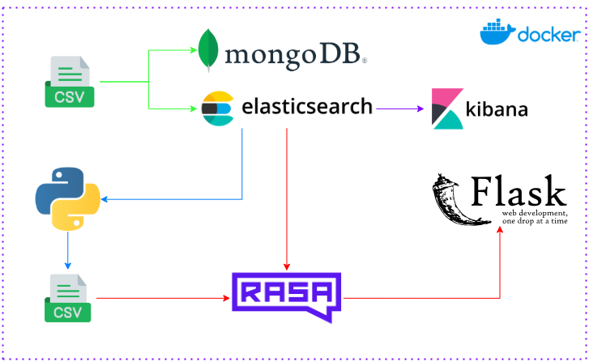
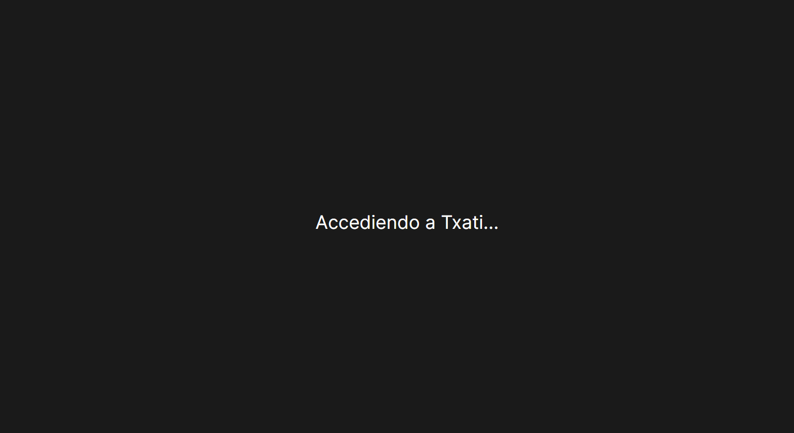

# Data Orchestrator

Data Orchestrator automatiza la ingesta de datos de taxis desde un CSV hacia MongoDB (backup) y Elasticsearch (base principal). Integra un chatbot hecho con Rasa que responde preguntas diferenciando entre comunes (respuestas desde CSV) y no comunes (consultas directas a Elasticsearch), con una interfaz web en Flask.

## Funcionalidades principales

- [Ingesta automática de CSV](ingestion/src/load_data.py) → MongoDB y Elasticsearch.

- Kibana para consultas gráficas a Elasticsearch.

- [API Common Questions](apis/common_questions_api.py) realiza consultas comunes a ElasticSearch cada 5 minutos y guarda respuestas en otro CSV.

- [Chatbot creado con Rasa](chatbot/actions/actions.py) que responde según si la pregunta es común o no.

- [Interfaz web en Flask](chatbot/app.py) para interactuar con el chatbot.

## Arquitectura



## Despliegue con Docker

1. Clonar el repositorio y acceder a la carpeta de deployment
``` bash
git clone https://github.com/maariogutierrez/data-orchestrator.git
cd data-orchestrator/deployment
```

2. Ejecutar Docker Compose:

``` bash
docker-compose up -d
```

3. Esperar a que se desplieguen todos los servicios.

``` bash
docker ps
docker logs -f <id del contenedor del chatbot>
```
El servicio estará listo cuando observemos el log

``` bash
Servidor Rasa iniciado ✅
```

4. Acceder a la interfaz del chatbot en: http://127.0.0.1:8001

[](https://youtu.be/N2D1xSq7qSE?si=4YLaqi-P5IOD6SC5)
